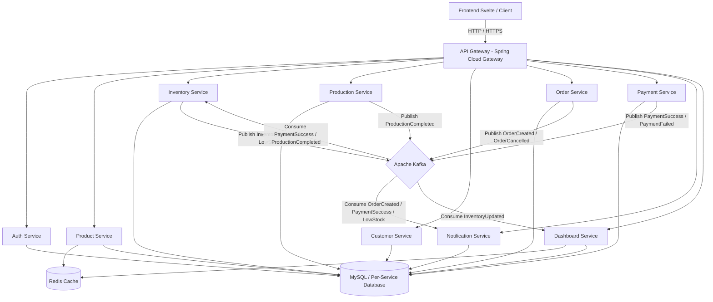

# TECHNICAL REQUIREMENTS DOCUMENT (TRD)
## Gula Management System (GulaHub) v1.0
**Status:** DRAFT | **Version:** 1.0 | **Date:** 2026-06-10

---

## 1. PENDAHULUAN & ARSITEKTUR SISTEM

Dokumen Persyaratan Teknis (TRD) ini mendefinisikan spesifikasi arsitektur, database, API, event-driven communication, caching, dan keamanan untuk **Gula Management System (GulaHub)**. 

### 1.1 Arsitektur Tingkat Tinggi (High-Level Architecture)
Sistem ini menggunakan arsitektur **Microservices** berbasis **Spring Boot** dengan **Spring Cloud Gateway** sebagai pintu masuk utama (API Gateway). Komunikasi antar service bersifat asynchronous event-driven menggunakan **Apache Kafka**, sedangkan caching data statis/dashboard menggunakan **Redis**.



### 1.2 Lingkungan Teknologi (Technology Stack)
*   **Backend Services:** Java 17, Spring Boot 3.x, Spring Cloud 2023.x
*   **API Gateway:** Spring Cloud Gateway (Reactive)
*   **Database:** MySQL 8.0 (Logical separation per-service)
*   **Cache & Session:** Redis 7.x
*   **Message Broker:** Apache Kafka 3.x
*   **Security:** JWT (JSON Web Token), Spring Security, BCrypt
*   **Containerization:** Docker & Docker Compose
*   **Frontend:** Svelte, Vite

---

## 2. DATABASE SCHEMA DESIGN

Setiap microservice memiliki database sendiri secara logis untuk menjamin independensi deployment (Database-per-Service pattern). Berikut adalah relasi data global (Master ERD):

### 2.1 Skema Tabel per-Service

#### 2.1.1 Auth Service (`gulahub_auth`)
*   **Table: `users`**
    *   `id` (UUID, PK)
    *   `username` (VARCHAR(50), Unique, Not Null)
    *   `email` (VARCHAR(100), Unique, Not Null)
    *   `password` (VARCHAR(255), Not Null) - BCrypt Hashed
    *   `role` (ENUM('OWNER', 'ADMIN_GUDANG', 'ADMIN_PENJUALAN'), Not Null)
    *   `created_at` (TIMESTAMP)

#### 2.1.2 Product Service (`gulahub_product`)
*   **Table: `product`**
    *   `id` (UUID, PK)
    *   `code` (VARCHAR(50), Unique, Not Null)
    *   `name` (VARCHAR(100), Not Null)
    *   `category` (VARCHAR(50), Not Null)
    *   `description` (TEXT)
    *   `price` (DECIMAL(12,2), Not Null)
    *   `weight` (DECIMAL(6,2), Not Null) - berat dalam kg
    *   `image_url` (VARCHAR(255))
    *   `status` (BOOLEAN, Not Null, Default true)
    *   `created_at` (TIMESTAMP)

#### 2.1.3 Inventory Service (`gulahub_inventory`)
*   **Table: `inventory`**
    *   `id` (UUID, PK)
    *   `product_id` (UUID, Unique, Not Null)
    *   `current_stock` (INT, Not Null, Default 0)
    *   `minimum_stock` (INT, Not Null, Default 10)
    *   `updated_at` (TIMESTAMP)
*   **Table: `stock_movement` (atau `inventory_transaction`)**
    *   `id` (UUID, PK)
    *   `inventory_id` (UUID, FK -> `inventory.id`)
    *   `movement_type` (ENUM('IN', 'OUT', 'ADJUSTMENT'), Not Null)
    *   `quantity` (INT, Not Null)
    *   `reference_type` (ENUM('production', 'order', 'manual', 'adjustment'), Not Null)
    *   `reference_id` (UUID) - ID dari dokumen terkait (misal Production ID atau Order ID)
    *   `notes` (TEXT)
    *   `created_at` (TIMESTAMP)

#### 2.1.4 Production Service (`gulahub_production`)
*   **Table: `production`**
    *   `id` (UUID, PK)
    *   `product_id` (UUID, Not Null)
    *   `quantity` (INT, Not Null)
    *   `production_date` (DATE, Not Null)
    *   `notes` (TEXT)
    *   `created_at` (TIMESTAMP)

#### 2.1.5 Customer Service (`gulahub_customer`)
*   **Table: `customer`**
    *   `id` (UUID, PK)
    *   `name` (VARCHAR(100), Not Null)
    *   `phone_number` (VARCHAR(20), Not Null)
    *   `email` (VARCHAR(100))
    *   `address` (TEXT)
    *   `created_at` (TIMESTAMP)

#### 2.1.6 Order Service (`gulahub_order`)
*   **Table: `orders`**
    *   `id` (UUID, PK)
    *   `customer_id` (UUID, Not Null)
    *   `order_date` (TIMESTAMP, Not Null)
    *   `total_amount` (DECIMAL(12,2), Not Null)
    *   `status` (ENUM('CREATED', 'PAID', 'PACKED', 'SHIPPED', 'COMPLETED', 'CANCELLED'), Not Null)
*   **Table: `order_item`**
    *   `id` (UUID, PK)
    *   `order_id` (UUID, FK -> `orders.id`)
    *   `product_id` (UUID, Not Null)
    *   `product_name` (VARCHAR(100), Not Null)
    *   `price` (DECIMAL(12,2), Not Null)
    *   `quantity` (INT, Not Null)
    *   `subtotal` (DECIMAL(12,2), Not Null)

#### 2.1.7 Payment Service (`gulahub_payment`)
*   **Table: `payment`**
    *   `id` (UUID, PK)
    *   `order_id` (UUID, Unique, Not Null)
    *   `amount` (DECIMAL(12,2), Not Null)
    *   `payment_method` (ENUM('CASH', 'BANK_TRANSFER', 'OTHER'), Not Null)
    *   `status` (ENUM('PENDING', 'SUCCESS', 'FAILED'), Not Null)
    *   `payment_date` (TIMESTAMP)
    *   `created_at` (TIMESTAMP)

#### 2.1.8 Notification Service (`gulahub_notification`)
*   **Table: `notification_history`**
    *   `id` (UUID, PK)
    *   `recipient` (VARCHAR(100), Not Null) - Email / No. Telp
    *   `type` (ENUM('LOW_STOCK', 'ORDER_CREATED', 'PAYMENT_SUCCESS'), Not Null)
    *   `message` (TEXT, Not Null)
    *   `status` (ENUM('SENT', 'FAILED'), Not Null)
    *   `sent_at` (TIMESTAMP)

---

## 3. SPESIFIKASI ENDPOINT API (LENGKAP)

Semua REST API menggunakan format JSON untuk request dan response. Endpoint yang membutuhkan autentikasi harus mengirim header: `Authorization: Bearer <JWT_TOKEN>`.

### 3.1 Gateway Service (`gateway-service`)
Gateway bertugas melakukan routing ke service internal. Tidak memiliki endpoint bisnis, melainkan endpoint proxy:
*   `/api/v1/auth/**` -> `auth-service`
*   `/api/v1/products/**` -> `product-service`
*   `/api/v1/inventories/**` -> `inventory-service`
*   `/api/v1/productions/**` -> `production-service`
*   `/api/v1/customers/**` -> `customer-service`
*   `/api/v1/orders/**` -> `order-service`
*   `/api/v1/payments/**` -> `payment-service`
*   `/api/v1/notifications/**` -> `notification-service`
*   `/api/v1/dashboard/**` -> `dashboard-service`

### 3.2 Auth Service (`auth-service`)
Mengelola pendaftaran user, autentikasi, dan validasi token.

#### 3.2.1 Register User Baru
*   **Method / Path:** `POST /api/v1/auth/register`
*   **Akses:** Public (atau khusus Owner tergantung konfigurasi)
*   **Request Body:**
    ```json
    {
      "username": "admingudang1",
      "email": "gudang1@gulahub.com",
      "password": "SecretPassword123",
      "role": "ADMIN_GUDANG"
    }
    ```
*   **Response (201 Created):**
    ```json
    {
      "id": "e8c8942b-5b5c-48c2-8c1d-12b2e8c8942b",
      "username": "admingudang1",
      "role": "ADMIN_GUDANG",
      "message": "User registered successfully"
    }
    ```
*   **Response (400 Bad Request):** Username/email sudah terdaftar atau format password lemah.

#### 3.2.2 Login User
*   **Method / Path:** `POST /api/v1/auth/login`
*   **Akses:** Public
*   **Request Body:**
    ```json
    {
      "username": "admingudang1",
      "password": "SecretPassword123"
    }
    ```
*   **Response (200 OK):**
    ```json
    {
      "accessToken": "eyJhbGciOiJIUzI1NiIsInR5...",
      "tokenType": "Bearer",
      "expiresIn": 86400,
      "role": "ADMIN_GUDANG"
    }
    ```
*   **Response (401 Unauthorized):** Password atau username salah.

### 3.3 Product Service (`product-service`)
Mengelola data katalog produk. Data produk dicache di Redis untuk operasi read yang cepat.

#### 3.3.1 List Products (Paginated & Filtered)
*   **Method / Path:** `GET /api/v1/products`
*   **Akses:** Owner, Admin Gudang, Admin Penjualan
*   **Query Params:**
    *   `page` (default: 0)
    *   `size` (default: 10)
    *   `q` (search by name/code, optional)
    *   `category` (optional)
*   **Response (200 OK):**
    ```json
    {
      "data": [
        {
          "id": "550e8400-e29b-41d4-a716-446655440001",
          "code": "P001",
          "name": "Gula Aren 250gr",
          "category": "Gula Aren",
          "price": 20000.00,
          "weight": 0.25,
          "imageUrl": "https://gulahub-bucket.s3.amazonaws.com/gula_aren_250.jpg",
          "status": true
        }
      ],
      "page": 0,
      "size": 10,
      "totalElements": 1,
      "totalPages": 1
    }
    ```

#### 3.3.2 Get Product Detail
*   **Method / Path:** `GET /api/v1/products/{id}`
*   **Akses:** Owner, Admin Gudang, Admin Penjualan
*   **Response (200 OK):**
    ```json
    {
      "id": "550e8400-e29b-41d4-a716-446655440001",
      "code": "P001",
      "name": "Gula Aren 250gr",
      "category": "Gula Aren",
      "description": "Gula aren murni berkualitas tinggi kemasan 250 gram",
      "price": 20000.00,
      "weight": 0.25,
      "imageUrl": "https://gulahub-bucket.s3.amazonaws.com/gula_aren_250.jpg",
      "status": true
    }
    ```
*   **Response (404 Not Found):** ID produk tidak ditemukan.

#### 3.3.3 Create Product
*   **Method / Path:** `POST /api/v1/products`
*   **Akses:** Owner
*   **Request Body:**
    ```json
    {
      "code": "P002",
      "name": "Gula Kelapa 500gr",
      "category": "Gula Kelapa",
      "description": "Gula kelapa cetak alami kemasan 500 gram",
      "price": 35000.00,
      "weight": 0.50,
      "imageUrl": "https://gulahub-bucket.s3.amazonaws.com/gula_kelapa_500.jpg",
      "status": true
    }
    ```
*   **Response (201 Created):**
    ```json
    {
      "id": "550e8400-e29b-41d4-a716-446655440004",
      "code": "P002",
      "message": "Product created successfully"
    }
    ```
*   **Cache Behavior:** Evict cache list (`products`) pada Redis.

#### 3.3.4 Update Product
*   **Method / Path:** `PUT /api/v1/products/{id}`
*   **Akses:** Owner
*   **Request Body:** (Sama dengan format Create)
*   **Response (200 OK):**
    ```json
    {
      "id": "550e8400-e29b-41d4-a716-446655440001",
      "message": "Product updated successfully"
    }
    ```
*   **Cache Behavior:** Evict cache detail (`product:{id}`) dan cache list (`products`).

#### 3.3.5 Delete Product (Soft Delete / Status Deactivation)
*   **Method / Path:** `DELETE /api/v1/products/{id}`
*   **Akses:** Owner
*   **Response (204 No Content):** (No body)
*   **Cache Behavior:** Evict cache detail (`product:{id}`) dan cache list (`products`).

### 3.4 Inventory Service (`inventory-service`)
Mengelola stok produk dan riwayat transaksi stok.

#### 3.4.1 Get Inventory by Product ID
*   **Method / Path:** `GET /api/v1/inventories/product/{productId}`
*   **Akses:** Owner, Admin Gudang
*   **Response (200 OK):**
    ```json
    {
      "id": "550e8400-e29b-41d4-a716-446655440006",
      "productId": "550e8400-e29b-41d4-a716-446655440001",
      "currentStock": 85,
      "minimumStock": 10,
      "updatedAt": "2026-06-10T10:15:30Z"
    }
    ```

#### 3.4.2 Stock In (Manual / Penambahan Manual)
*   **Method / Path:** `POST /api/v1/inventories/{inventoryId}/in`
*   **Akses:** Admin Gudang
*   **Request Body:**
    ```json
    {
      "quantity": 50,
      "notes": "Penyesuaian stok masuk manual dari kebun luar"
    }
    ```
*   **Response (200 OK):**
    ```json
    {
      "inventoryId": "550e8400-e29b-41d4-a716-446655440006",
      "previousStock": 85,
      "newStock": 135,
      "message": "Stock added successfully"
    }
    ```
*   **Event Emitted:** `InventoryUpdatedEvent` pada Kafka.

#### 3.4.3 Stock Out (Manual / Kerusakan / Kehilangan)
*   **Method / Path:** `POST /api/v1/inventories/{inventoryId}/out`
*   **Akses:** Admin Gudang
*   **Request Body:**
    ```json
    {
      "quantity": 5,
      "notes": "Gula rusak / digigit tikus"
    }
    ```
*   **Response (200 OK):**
    ```json
    {
      "inventoryId": "550e8400-e29b-41d4-a716-446655440006",
      "previousStock": 135,
      "newStock": 130,
      "message": "Stock reduced successfully"
    }
    ```
*   **Event Emitted:** `InventoryUpdatedEvent`. Jika stok di bawah minimum, emit `LowStockEvent`.

#### 3.4.4 Adjust Stock (Setelah Audit Gudang / Stock Opname)
*   **Method / Path:** `POST /api/v1/inventories/{inventoryId}/adjust`
*   **Akses:** Admin Gudang, Owner
*   **Request Body:**
    ```json
    {
      "quantity": -2,
      "notes": "Hasil Stock Opname Juni 2026"
    }
    ```
*   **Response (200 OK):**
    ```json
    {
      "inventoryId": "550e8400-e29b-41d4-a716-446655440006",
      "previousStock": 130,
      "newStock": 128,
      "message": "Stock adjusted successfully"
    }
    ```

#### 3.4.5 Get Inventory Transaction History
*   **Method / Path:** `GET /api/v1/inventories/{inventoryId}/transactions`
*   **Akses:** Owner, Admin Gudang
*   **Query Params:** `page`, `size`
*   **Response (200 OK):**
    ```json
    {
      "data": [
        {
          "id": "f8c8942b-5b5c-48c2-8c1d-12b2e8c8942c",
          "movementType": "OUT",
          "quantity": 2,
          "referenceType": "order",
          "referenceId": "550e8400-e29b-41d4-a716-446655440002",
          "notes": "Payment confirmed",
          "createdAt": "2026-06-04T11:05:00Z"
        }
      ],
      "page": 0,
      "size": 10,
      "total": 1
    }
    ```

### 3.5 Production Service (`production-service`)
Mencatat batch produksi baru.

#### 3.5.1 Create Production Record (Input Produksi Baru)
*   **Method / Path:** `POST /api/v1/productions`
*   **Akses:** Admin Gudang
*   **Request Body:**
    ```json
    {
      "productId": "550e8400-e29b-41d4-a716-446655440001",
      "quantity": 150,
      "productionDate": "2026-06-10",
      "notes": "Batch Pagi - Pengolahan Nira Aren Desa Karangsari"
    }
    ```
*   **Response (201 Created):**
    ```json
    {
      "productionId": "349ae8c8-1111-48c2-8c1d-12b2e8c89abc",
      "message": "Production record created, event queued for inventory update."
    }
    ```
*   **Event Emitted:** `ProductionCompletedEvent` ke Kafka topic `production.events`.

#### 3.5.2 List Production History
*   **Method / Path:** `GET /api/v1/productions`
*   **Akses:** Owner, Admin Gudang
*   **Query Params:** `productId` (optional), `startDate` (optional), `endDate` (optional), `page`, `size`
*   **Response (200 OK):**
    ```json
    {
      "data": [
        {
          "id": "349ae8c8-1111-48c2-8c1d-12b2e8c89abc",
          "productId": "550e8400-e29b-41d4-a716-446655440001",
          "quantity": 150,
          "productionDate": "2026-06-10",
          "notes": "Batch Pagi - Pengolahan Nira Aren Desa Karangsari"
        }
      ],
      "page": 0,
      "size": 10,
      "total": 1
    }
    ```

### 3.6 Customer Service (`customer-service`)
Mengelola data master pelanggan.

#### 3.6.1 Create Customer
*   **Method / Path:** `POST /api/v1/customers`
*   **Akses:** Admin Penjualan, Owner
*   **Request Body:**
    ```json
    {
      "name": "Budi Santoso",
      "phoneNumber": "081234567890",
      "email": "budi.santoso@gmail.com",
      "address": "Jl. Slamet Riyadi No. 45, Solo, Jawa Tengah"
    }
    ```
*   **Response (201 Created):**
    ```json
    {
      "id": "890f8400-e29b-41d4-a716-446655440099",
      "message": "Customer registered successfully"
    }
    ```

#### 3.6.2 Update Customer
*   **Method / Path:** `PUT /api/v1/customers/{id}`
*   **Akses:** Admin Penjualan, Owner
*   **Request Body:** (Sama dengan Create)
*   **Response (200 OK):**
    ```json
    {
      "id": "890f8400-e29b-41d4-a716-446655440099",
      "message": "Customer updated successfully"
    }
    ```

#### 3.6.3 List Customers
*   **Method / Path:** `GET /api/v1/customers`
*   **Akses:** Owner, Admin Penjualan
*   **Query Params:** `q` (search by name/phone, optional), `page`, `size`
*   **Response (200 OK):** List of customers.

#### 3.6.4 Get Customer by ID
*   **Method / Path:** `GET /api/v1/customers/{id}`
*   **Akses:** Owner, Admin Penjualan
*   **Response (200 OK):** Customer detail object.

### 3.7 Order Service (`order-service`)
Membuat order dan mengelola status transaksi.

#### 3.7.1 Create Order (Membuat Pesanan Baru)
*   **Method / Path:** `POST /api/v1/orders`
*   **Akses:** Admin Penjualan
*   **Request Body:**
    ```json
    {
      "customerId": "890f8400-e29b-41d4-a716-446655440099",
      "items": [
        {
          "productId": "550e8400-e29b-41d4-a716-446655440001",
          "productName": "Gula Aren 250gr",
          "price": 20000.00,
          "quantity": 2
        }
      ]
    }
    ```
*   **Behavior:**
    1. Sistem memanggil `inventory-service` secara synchronous/internal untuk mengecek stok.
    2. Jika stok tidak mencukupi, kembalikan error `400 Bad Request` dengan deskripsi detail.
    3. Jika cukup, rekam pesanan dengan status `CREATED`.
    4. Hitung total harga otomatis (Subtotal per item + Total Amount).
    5. Emit `OrderCreatedEvent` ke Kafka topic `order.events` (berfungsi untuk memicu inisiansi pembayaran & notifikasi).
*   **Response (201 Created):**
    ```json
    {
      "orderId": "550e8400-e29b-41d4-a716-446655440002",
      "status": "CREATED",
      "totalAmount": 40000.00,
      "message": "Order created successfully"
    }
    ```

#### 3.7.2 Get Order by ID
*   **Method / Path:** `GET /api/v1/orders/{id}`
*   **Akses:** Owner, Admin Penjualan
*   **Response (200 OK):**
    ```json
    {
      "id": "550e8400-e29b-41d4-a716-446655440002",
      "customerId": "890f8400-e29b-41d4-a716-446655440099",
      "orderDate": "2026-06-10T10:15:00Z",
      "totalAmount": 40000.00,
      "status": "CREATED",
      "items": [
        {
          "id": "78901234-e29b-41d4-a716-446655440123",
          "productId": "550e8400-e29b-41d4-a716-446655440001",
          "productName": "Gula Aren 250gr",
          "price": 20000.00,
          "quantity": 2,
          "subtotal": 40000.00
        }
      ]
    }
    ```

#### 3.7.3 Update Order Status
*   **Method / Path:** `PATCH /api/v1/orders/{id}/status`
*   **Akses:** Admin Penjualan, Owner
*   **Request Body:**
    ```json
    {
      "status": "PACKED"
    }
    ```
*   **Response (200 OK):**
    ```json
    {
      "orderId": "550e8400-e29b-41d4-a716-446655440002",
      "status": "PACKED",
      "message": "Order status updated successfully"
    }
    ```

#### 3.7.4 List Orders
*   **Method / Path:** `GET /api/v1/orders`
*   **Akses:** Owner, Admin Penjualan
*   **Query Params:** `status` (optional), `page`, `size`
*   **Response (200 OK):** Paginated list of orders.

### 3.8 Payment Service (`payment-service`)
Mengelola pembayaran pesanan.

#### 3.8.1 Initiate Payment (Membuat Tagihan)
*   **Method / Path:** `POST /api/v1/payments`
*   **Akses:** Admin Penjualan (biasanya terpicu otomatis via listener, tapi bisa dipanggil manual)
*   **Request Body:**
    ```json
    {
      "orderId": "550e8400-e29b-41d4-a716-446655440002",
      "paymentMethod": "BANK_TRANSFER",
      "amount": 40000.00
    }
    ```
*   **Response (201 Created):**
    ```json
    {
      "paymentId": "550e8400-e29b-41d4-a716-446655440005",
      "status": "PENDING"
    }
    ```

#### 3.8.2 Confirm Payment (Penyelesaian Pembayaran)
*   **Method / Path:** `POST /api/v1/payments/{id}/confirm`
*   **Akses:** Admin Penjualan
*   **Request Body:**
    ```json
    {
      "status": "SUCCESS",
      "paymentDate": "2026-06-10T10:20:00Z"
    }
    ```
*   **Behavior:**
    1. Update status pembayaran menjadi `SUCCESS` di database.
    2. Emit event `PaymentSuccessEvent` ke Kafka topic `payment.events`. 
    3. `inventory-service` akan mengonsumsi event ini dan secara otomatis memotong stok barang.
    4. `notification-service` akan mengonsumsi event ini untuk mengirim notifikasi sukses pembayaran.
*   **Response (200 OK):**
    ```json
    {
      "paymentId": "550e8400-e29b-41d4-a716-446655440005",
      "status": "SUCCESS",
      "message": "Payment confirmed and event published."
    }
    ```

#### 3.8.3 Get Payment by Order ID
*   **Method / Path:** `GET /api/v1/payments/order/{orderId}`
*   **Akses:** Owner, Admin Penjualan
*   **Response (200 OK):** Payment record detail.

### 3.9 Notification Service (`notification-service`)
Mengelola log internal pengiriman notifikasi.

#### 3.9.1 List Sent Notifications (Audit Log)
*   **Method / Path:** `GET /api/v1/notifications`
*   **Akses:** Owner
*   **Query Params:** `page`, `size`
*   **Response (200 OK):** Paginated list of notification history.

#### 3.9.2 Send Test Notification
*   **Method / Path:** `POST /api/v1/notifications/test`
*   **Akses:** Owner
*   **Request Body:**
    ```json
    {
      "type": "LOW_STOCK",
      "message": "TEST: Stok Gula Aren menipis",
      "recipient": "owner@gulahub.com"
    }
    ```
*   **Response (200 OK):**
    ```json
    {
      "message": "Test notification sent successfully"
    }
    ```

### 3.10 Dashboard Service (`dashboard-service`)
Mengagregasi data bisnis dan menyediakan Ringkasan Dashboard.

#### 3.10.1 Get Dashboard Summary
*   **Method / Path:** `GET /api/v1/dashboard/summary`
*   **Akses:** Owner
*   **Behavior:**
    *   Membaca data teragregasi dari cache Redis key `dashboard_summary`.
    *   Jika cache miss, hitung statistik dari database (Product, Inventory, Order, dan Payment), lalu simpan kembali ke Redis dengan TTL 5 menit.
*   **Response (200 OK):**
    ```json
    {
      "salesSummary": {
        "todaySales": 1250000.00,
        "monthlySales": 45000000.00
      },
      "inventorySummary": {
        "totalProducts": 15,
        "totalStock": 1420
      },
      "lowStockProducts": [
        {
          "productId": "550e8400-e29b-41d4-a716-446655440001",
          "productName": "Gula Aren 250gr",
          "currentStock": 8,
          "minimumStock": 10
        }
      ],
      "topSellingProducts": [
        {
          "productId": "550e8400-e29b-41d4-a716-446655440001",
          "productName": "Gula Aren 250gr",
          "totalQuantitySold": 340
        }
      ],
      "recentOrders": [
        {
          "orderId": "550e8400-e29b-41d4-a716-446655440002",
          "customerName": "Budi Santoso",
          "totalAmount": 40000.00,
          "status": "PAID",
          "orderDate": "2026-06-10T10:15:00Z"
        }
      ]
    }
    ```

---

## 4. STRATEGI CACHING (REDIS)

Redis digunakan untuk meningkatkan performa respon API dan mengurangi beban database MySQL.

### 4.1 Desain Key Redis & TTL

| Fitur | Key Pattern | Tipe Data | TTL | Kebijakan Invalidation (Evict) |
|---|---|---|---|---|
| **Daftar Produk** | `products` | String / JSON | 10 Menit | Dihapus (Evict) saat terjadi Create / Update / Delete di `product-service` |
| **Detail Produk** | `product:{id}` | String / JSON | 10 Menit | Dihapus saat terjadi Update / Delete pada `{id}` produk terkait |
| **Ringkasan Dashboard** | `dashboard_summary` | String / JSON | 5 Menit | Di-evict secara otomatis saat event `InventoryUpdatedEvent` atau `PaymentSuccessEvent` dikonsumsi oleh `dashboard-service` |

---

## 5. KAFKA EVENT ARCHITECTURE (KONTRAK DATA LENGKAP)

Semua event dikirim dalam format JSON. Setiap event wajib menyertakan metadata standard seperti `eventId` dan `eventTimestamp`.

### 5.1 Topic List & Configuration
*   `production.events` (Partitions: 3, Replication Factor: 2)
*   `order.events` (Partitions: 3, Replication Factor: 2)
*   `payment.events` (Partitions: 3, Replication Factor: 2)
*   `inventory.events` (Partitions: 3, Replication Factor: 2)
*   `inventory.lowstock` (Partitions: 3, Replication Factor: 2)

### 5.2 Skema Payload Event

#### 5.2.1 ProductionCompletedEvent (Topic: `production.events`)
Dipublish oleh `production-service` ketika ada batch produksi baru yang didaftarkan.
```json
{
  "eventId": "f8c8942b-5b5c-48c2-8c1d-12b2e8c8942a",
  "eventTimestamp": "2026-06-10T10:00:00.000Z",
  "productionId": "349ae8c8-1111-48c2-8c1d-12b2e8c89abc",
  "productId": "550e8400-e29b-41d4-a716-446655440001",
  "quantity": 150,
  "productionDate": "2026-06-10",
  "notes": "Batch Pagi - Pengolahan Nira Aren Desa Karangsari"
}
```

#### 5.2.2 OrderCreatedEvent (Topic: `order.events`)
Dipublish oleh `order-service` saat order berhasil dibuat (dengan status `CREATED`).
```json
{
  "eventId": "f8c8942b-5b5c-48c2-8c1d-12b2e8c8942b",
  "eventTimestamp": "2026-06-10T10:15:05.000Z",
  "orderId": "550e8400-e29b-41d4-a716-446655440002",
  "customerId": "890f8400-e29b-41d4-a716-446655440099",
  "totalAmount": 40000.00,
  "items": [
    {
      "productId": "550e8400-e29b-41d4-a716-446655440001",
      "productName": "Gula Aren 250gr",
      "quantity": 2,
      "price": 20000.00,
      "subtotal": 40000.00
    }
  ],
  "orderDate": "2026-06-10T10:15:00.000Z"
}
```

#### 5.2.3 PaymentSuccessEvent (Topic: `payment.events`)
Dipublish oleh `payment-service` saat status pembayaran dikonfirmasi `SUCCESS`.
```json
{
  "eventId": "f8c8942b-5b5c-48c2-8c1d-12b2e8c8942c",
  "eventTimestamp": "2026-06-10T10:20:05.000Z",
  "paymentId": "550e8400-e29b-41d4-a716-446655440005",
  "orderId": "550e8400-e29b-41d4-a716-446655440002",
  "customerId": "890f8400-e29b-41d4-a716-446655440099",
  "amount": 40000.00,
  "paymentMethod": "BANK_TRANSFER",
  "paymentDate": "2026-06-10T10:20:00.000Z"
}
```

#### 5.2.4 InventoryUpdatedEvent (Topic: `inventory.events`)
Dipublish oleh `inventory-service` setiap kali ada stok masuk/keluar/penyesuaian untuk memicu update dashboard.
```json
{
  "eventId": "f8c8942b-5b5c-48c2-8c1d-12b2e8c8942d",
  "eventTimestamp": "2026-06-10T10:20:10.000Z",
  "inventoryId": "550e8400-e29b-41d4-a716-446655440006",
  "productId": "550e8400-e29b-41d4-a716-446655440001",
  "previousStock": 87,
  "currentStock": 85,
  "minimumStock": 10,
  "transactionType": "OUT",
  "changeQuantity": -2,
  "referenceType": "order",
  "referenceId": "550e8400-e29b-41d4-a716-446655440002"
}
```

#### 5.2.5 LowStockEvent (Topic: `inventory.lowstock`)
Dipublish oleh `inventory-service` ketika `currentStock` < `minimumStock`.
```json
{
  "eventId": "f8c8942b-5b5c-48c2-8c1d-12b2e8c8942e",
  "eventTimestamp": "2026-06-10T10:20:12.000Z",
  "inventoryId": "550e8400-e29b-41d4-a716-446655440006",
  "productId": "550e8400-e29b-41d4-a716-446655440001",
  "productName": "Gula Aren 250gr",
  "currentStock": 8,
  "minimumStock": 10
}
```

---

## 6. SISTEM KEAMANAN & OTORISASI (RBAC)

Autentikasi menggunakan standard token **JWT** didekripsi di API Gateway. Gateway akan meneruskan info User ID dan Role melalui header HTTP untuk dikonsumsi oleh downstream service.

### 6.1 Desain Token JWT (Payload Claims)
Token JWT yang digenerate setelah login sukses harus memiliki payload minimal:
```json
{
  "sub": "e8c8942b-5b5c-48c2-8c1d-12b2e8c8942b",
  "username": "admingudang1",
  "role": "ADMIN_GUDANG",
  "iss": "gulahub-auth-service",
  "iat": 1781085336,
  "exp": 1781171736
}
```

### 6.2 Konfigurasi Downstream Header Propagation
Gateway menvalidasi tanda tangan JWT. Jika valid, gateway memetakan payload claim ke header downstream:
*   `X-User-Id` : Berisi nilai claim `sub` (UUID User)
*   `X-User-Role` : Berisi nilai claim `role`

### 6.3 Matriks Otorisasi Endpoint (RBAC Matrix)

| Microservice | Path / API | OWNER | ADMIN_GUDANG | ADMIN_PENJUALAN |
|---|---|---|---|---|
| **Product** | `GET /api/v1/products/**` | ✅ | ✅ | ✅ |
| | `POST/PUT/DELETE /api/v1/products/**` | ✅ | ❌ | ❌ |
| **Inventory** | `GET /api/v1/inventories/**` | ✅ | ✅ | ❌ |
| | `POST /api/v1/inventories/**/in` | ❌ | ✅ | ❌ |
| | `POST /api/v1/inventories/**/out` | ❌ | ✅ | ❌ |
| | `POST /api/v1/inventories/**/adjust` | ✅ | ✅ | ❌ |
| **Production**| `POST /api/v1/productions` | ❌ | ✅ | ❌ |
| | `GET /api/v1/productions/**` | ✅ | ✅ | ❌ |
| **Customer** | `ALL /api/v1/customers/**` | ✅ | ❌ | ✅ |
| **Order** | `POST /api/v1/orders` | ❌ | ❌ | ✅ |
| | `GET /api/v1/orders/**` | ✅ | ❌ | ✅ |
| | `PATCH /api/v1/orders/**/status` | ✅ | ❌ | ✅ |
| **Payment** | `ALL /api/v1/payments/**` | ✅ | ❌ | ✅ |
| **Dashboard** | `GET /api/v1/dashboard/**` | ✅ | ❌ | ❌ |

---

## 7. STATE MANAGEMENT & PENANGANAN GAGAL (SAGA FLOW)

Karena sistem menggunakan arsitektur microservices terdistribusi, kegagalan stok atau pembayaran ditangani menggunakan pola **Choreography SAGA**.

### 7.1 Flow Sukses (Happy Path)
1.  **Order Service** membuat pesanan (`status = CREATED`) -> Mengirim `OrderCreatedEvent`.
2.  **Payment Service** merekam tagihan. Admin melakukan konfirmasi pembayaran sukses -> Mengubah tagihan (`status = SUCCESS`) -> Mengirim `PaymentSuccessEvent`.
3.  **Inventory Service** memotong stok barang sesuai pesanan -> Membuat riwayat transaksi stok (`movement_type = OUT`, `reference_type = order`) -> Mengirim `InventoryUpdatedEvent`.
4.  **Order Service** (yang mendengarkan `InventoryUpdatedEvent` dengan status sukses) -> Mengubah status order menjadi `PAID`.
5.  **Notification Service** mengirim notifikasi pembayaran sukses ke pelanggan.

### 7.2 Flow Kegagalan Stok (Compensating Transaction)
Jika pembayaran berhasil, tetapi saat `Inventory Service` mencoba memotong stok ternyata stok barang tidak mencukupi (misal akibat race condition / penjualan manual tanpa stock reservation):
1.  **Inventory Service** mendeteksi stok tidak mencukupi (stok akan menjadi negatif).
2.  **Inventory Service** membatalkan pemotongan stok dan mempublish `StockAllocationFailedEvent` pada Kafka topic `inventory.events`.
3.  **Payment Service** mendengarkan `StockAllocationFailedEvent`:
    *   Mengubah status transaksi pembayaran menjadi `FAILED` / `REFUND_PENDING`.
    *   Memicu alur refund manual atau otomatis.
4.  **Order Service** mendengarkan `StockAllocationFailedEvent`:
    *   Mengubah status order menjadi `CANCELLED`.
    *   Mengisi log catatan order: "Pembatalan otomatis akibat kegagalan alokasi stok".
5.  **Notification Service** mengirim notifikasi ke Admin Penjualan dan Pelanggan bahwa pesanan dibatalkan dan proses refund diinisiasi.

---

## 8. NON-FUNCTIONAL REQUIREMENTS & ERROR HANDLING

### 8.1 Response API & Standar Error
Downstream service harus menangani error secara elegan dengan mengembalikan response terstruktur:
*   **Response Error Structure:**
    ```json
    {
      "timestamp": "2026-06-10T10:55:00.000Z",
      "status": 400,
      "error": "Bad Request",
      "message": "Stok tidak mencukupi untuk melakukan transaksi",
      "path": "/api/v1/inventories/550e8400-e29b-41d4-a716-446655440006/out"
    }
    ```

### 8.2 Resilience & Retry Logic (Kafka)
*   Setiap consumer memiliki mekanisme retry sebanyak **5 kali** dengan **Exponential Backoff** (1s, 2s, 4s, 8s, 16s).
*   Jika setelah 5 kali percobaan masih gagal, event dikirim ke **Dead Letter Queue (DLQ)** dengan nama topic `{original-topic}.dlq` (misal `payment.events.dlq`) untuk penanganan/analisis manual oleh Tim Operations.
*   Pemeriksaan **Idempotency** wajib dilakukan pada level consumer dengan menyimpan dan mengecek `eventId` sebelum memproses data untuk menghindari double-processing akibat jaringan yang tidak stabil.
